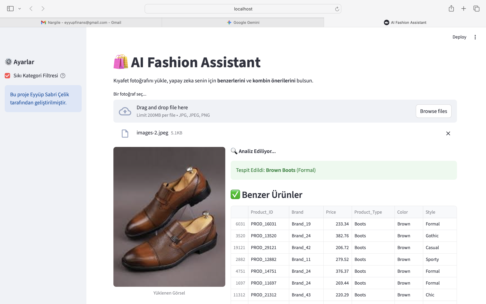
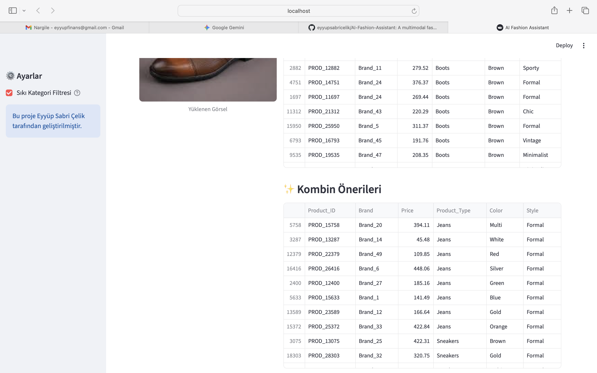

# 🛍️ AI Fashion Assistant: Multimodal Recommendation System


## 🎯 Proje Hakkında
Bu proje, e-ticaret dünyasındaki en büyük zorluklardan biri olan **"Cold Start" (Soğuk Başlangıç)** problemini çözmek için geliştirilmiş hibrit bir yapay zeka asistanıdır.

Geleneksel öneri sistemleri (Collaborative Filtering), ürünleri önermek için geçmiş kullanıcı verisine (tıklama, satın alma) ihtiyaç duyar. Ancak sisteme yeni yüklenen bir ürünün hiç verisi yoktur. **AI Fashion Assistant**, Google Gemini'ın **Görsel Zekasını (Vision AI)** ve **İçerik Tabanlı Filtreleme (Content-Based Filtering)** yöntemini birleştirerek, bir ürünün sadece fotoğrafından özelliklerini anlar ve anında satışa yönelik öneriler sunar.

> **Özetle:** Fotoğrafı yükle, yapay zeka ürünü tanısın, hem benzerlerini hem de o ürünle gidecek kombini saniyeler içinde oluştursun.

<p align="center">
  
  
</p>

---

## 🚀 Temel Özellikler ve Mühendislik Detayları

### 1. 🧠 Multimodal Analiz (Vision to Features)
Sistem, yüklenen fotoğrafı **Google Gemini 2.0 Flash** modeline gönderir. Model, basit bir etiketleme yapmak yerine, önceden tanımlanmış katı şemalarla (Strict Schema) şu özellikleri çıkarır:
* **Kategori:** (Örn: Trousers, Dress)
* **Renk:** (Örn: Black, Navy)
* **Tarz:** (Örn: Casual, Bohemian)

### 2. ⚖️ Ağırlıklı Özellik Mühendisliği (Weighted Feature Engineering)
Standart KNN algoritmalarının aksine, bu projede özelliklere özel ağırlıklar atanmıştır. Bu sayede önerilerin kalitesi artırılmıştır:
* **Product_Type (10.0):** Kullanıcı pantolon ararken yanlışlıkla şort görmesin diye en yüksek ağırlık.
* **Gender (8.0):** Erkek kullanıcılara kadın ürünü önermemek için kritik bariyer.
* **Color (5.0) & Style (6.0):** Görsel benzerliği yakalamak için dengeli katsayılar.

### 3. ✨ Kural Tabanlı Kombin Motoru
Sadece benzer ürünleri bulmakla kalmaz, ürünler arası ilişki haritası (`complementary_map`) kullanarak tamamlayıcı ürün önerir.
* *Örnek Senaryo:* Sistem **"Siyah Pantolon"** tespit ederse, veritabanından buna en uygun **"Gömlek"** veya **"Sneaker"** kategorisindeki ürünleri, yine renk ve tarz uyumuna göre filtreleyerek getirir.

### 4. 🛡️ Robust (Dayanıklı) Mimari
* **Fault Tolerance:** API bağlantısı koparsa veya kota dolarsa sistem çökmez; otomatik olarak "Offline Mock Modu"na geçerek sentetik veri ile çalışmaya devam eder.
* **Caching:** Streamlit önbellekleme mekanizması ile veri seti ve model her defasında yeniden yüklenmez, performans optimize edilir.

---

## 🛠️ Teknik Mimari

Proje aşağıdaki teknolojiler üzerine kurulmuştur:

* **LLM / Vision:** Google Gemini API (Görsel Anlamlandırma)
* **Machine Learning:** Scikit-Learn (NearestNeighbors, OneHotEncoder, MinMaxScaler, ColumnTransformer)
* **Data Processing:** Pandas & NumPy
* **Web UI:** Streamlit
* **Veri:** 20.000 satırlık sentetik moda veri seti (Mock Data)

### 📂 Proje Yapısı
```text
AI-Fashion-Assistant/
├── app.py                       # Streamlit ana uygulama dosyası (Frontend & Backend logic)
├── config_template.py           # API Key yapılandırma şablonu
├── fashion_products_mock_data.csv # 20.000 satırlık sentetik veri seti (Cache destekli)
├── benzerlik_projesi.ipynb      # Geliştirme, analiz ve model doğrulama notebook'u
├── requirements.txt             # Gerekli Python kütüphaneleri
├── README.md                    # Proje dokümantasyonu
└── assets/                      # Ekran görüntüleri klasörü

## 📊 Performans Değerlendirmesi

Modelin görsel algılama başarısı, geliştirme aşamasında (`benzerlik_projesi.ipynb`) farklı kategorilerden oluşan test verisi (Ground Truth) üzerinde değerlendirilmiştir.

| Test Görseli | Gerçek Etiket (Ground Truth) | Model Tahmini | Sonuç |
| :--- | :--- | :--- | :--- |
| `test_image.jpg` | Blue Shirt | Blue Shirt | ✅ BAŞARILI |
| `test_image1.jpg` | Black Trousers | Black Trousers | ✅ BAŞARILI |
| `test_image2.jpg` | Pink Jacket | Pink Jacket | ✅ BAŞARILI |

**Sonuç:** Görsel sınıflandırma modülü test setinde **%100 doğruluk (Classification Accuracy)** ile çalışmaktadır.

---

## ⚠️ Sınırlamalar (Limitations)

Proje şu an **MVP (Minimum Viable Product)** aşamasında olduğu için bazı teknik kısıtlar içermektedir:

* **Sentetik Veri (Synthetic Data):** Sistem şu anda gerçek kullanıcı davranış verileriyle (tıklama, sepete atma) değil, sentetik olarak üretilmiş 20.000 ürünlük veri setiyle çalışmaktadır. Bu nedenle öneriler "kişiselleştirilmiş" değil, "içerik benzerliği" odaklıdır.
* **API Gecikmesi (Latency):** Görsel analiz işlemi gerçek zamanlı olarak Google Gemini API üzerinden yapıldığı için, yoğunluk durumuna bağlı olarak 2-4 saniyelik gecikmeler yaşanabilir. (Prodüksiyon ortamında bu işlem Asenkron Kuyruk yapısına taşınmalıdır.)
* **Tekli Ürün Odaklı:** Sistem şu an fotoğraftaki baskın olan **tek bir ürünü** (örn: sadece ceketi) analiz eder.

---

## 💻 Kurulum ve Çalıştırma

Projeyi yerel makinenizde çalıştırmak için adımları izleyin:

1. **Repoyu Klonlayın:**
   ```bash
   git clone https://github.com/eyyupsabricelik/AI-Fashion-Assistant.git
   cd AI-Fashion-Assistant

2. **Gerekli Kütüphaneleri Yükleyin:**
    ```bash
    pip install -r requirements.txt


3. **API Anahtarını Ayarlayın:**

    config_template.py dosyasının adını config.py olarak değiştirin.
    İçindeki MY_KEY kısmına Google Gemini API anahtarınızı yapıştırın.

4. **Uygulamayı Başlatın:**
    ```bash
    streamlit run app.py

## 🔮 Gelecek Planları (Roadmap)

- [ ] **Vektör Veritabanı:** 20.000 ürün için KNN yeterli; ancak milyonluk ölçekler için **Faiss** veya **Pinecone** entegrasyonu.
- [ ] **Sanal Deneme (VTO):** Generative AI kullanılarak, seçilen kıyafetin kullanıcının fotoğrafı üzerine giydirilmesi.
- [ ] **Kullanıcı Geri Bildirimi:** Önerilerin beğenilme durumuna göre ağırlıkların (**weights**) otomatik olarak optimize edilmesi.

## 👨‍💻 Geliştirici

**Eyyüp Sabri Çelik** — *Data Science & Machine Learning Enthusiast*

Bu proje, modern yapay zeka araçlarını klasik makine öğrenmesi algoritmalarıyla birleştirerek  
gerçek dünya problemlerine çözüm üretmek amacıyla geliştirilmiştir.
